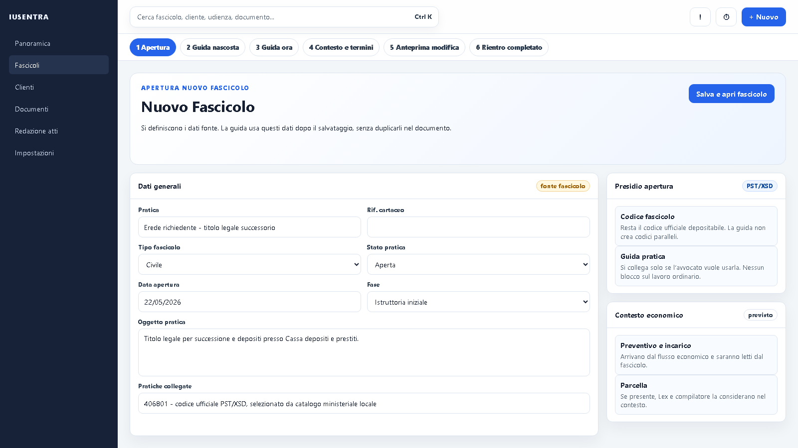
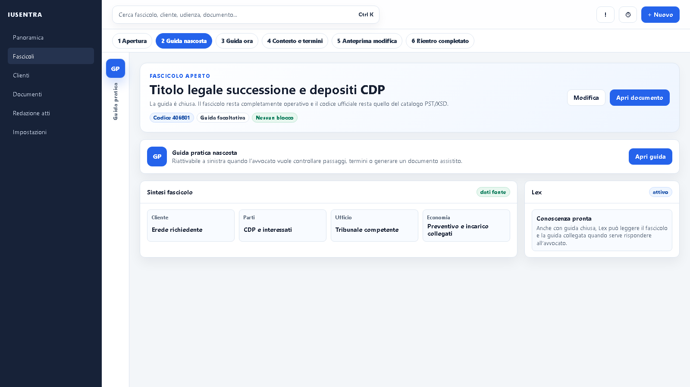
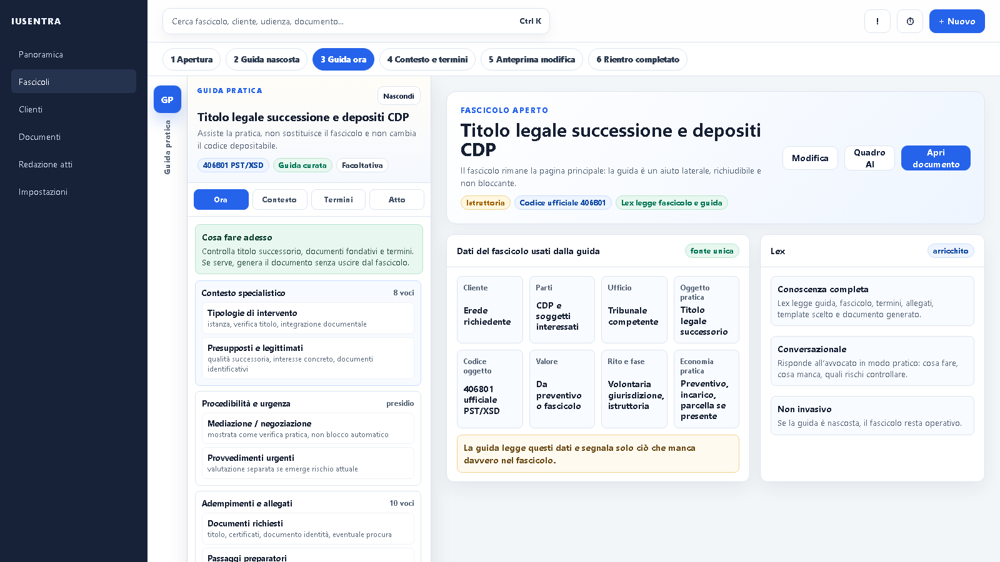
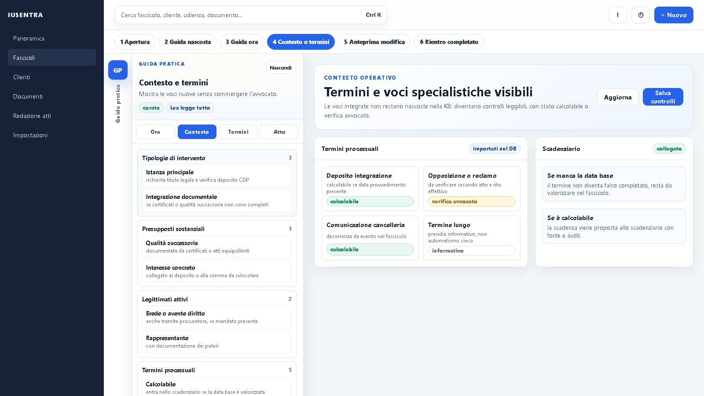
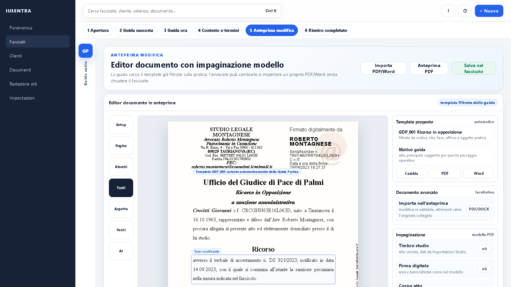
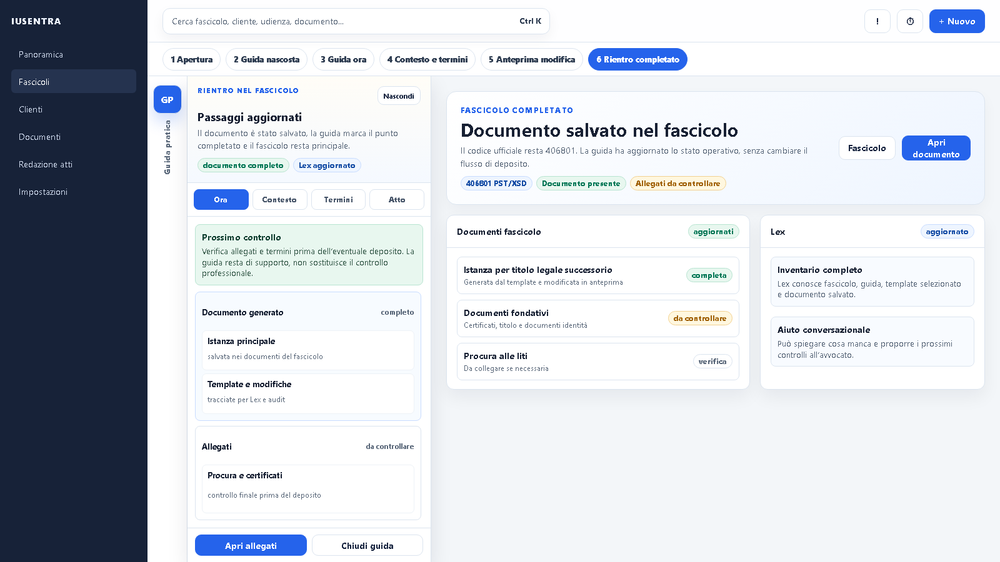
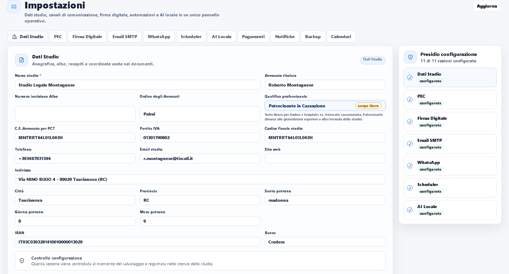

# Guida Pratica, template atti e piano assistito del fascicolo

Aggiornato: 15 agosto 2026.

## Import archivi utente set42–49 — 15 agosto 2026

- Gli archivi `files (31).zip`–`files (38).zip` hanno apportato 400 schede giuridiche e 400 termini; 399 schede e 399 termini sono stati integrati nei moduli `kb_98_set42_*`–`kb_98_set49_*`, nel KB completo e nel repository termini.
- Ogni scheda importata è una guida interna: non modifica, non sovrascrive e non abilita alcun `codice_oggetto_pst` ufficiale. Il catalogo di deposito resta a 1.018 record ufficiali curati.
- La scheda sorgente `415120`, «Esecutore testamentario: nomina, poteri e responsabilità (artt. 700-712 c.c.)», è stata esclusa dal merge perché duplicava una guida canonica già presente ma con contenuto divergente. Il report di import registra codice sorgente, guida canonica e motivazione della deduplicazione.
- Gli undici documenti Word dell'archivio `files (30).zip` sono temi scolastici di attualità e non costituiscono materiale operativo per la Guida Avvocato: restano fuori dall'importazione.
- Tracciabilità: `artifacts/guida-pratica/kb-set42-43-44-45-46-47-48-49-import-summary.json`, audit campi utente, audit arricchimento web, audit validazione, report termini e controllo UTF-8 datati 15 agosto 2026.
- Prova reale: su `http://127.0.0.1:8080/fascicoli/DD242366#guida-pratica` la guida è stata aperta, è stata selezionata la sezione Normativa e sono stati verificati focus, hover, refresh, scorrimento completo e resa desktop/tablet/mobile senza overflow orizzontale. Il refresh a cache calda ha completato in circa 1,6 secondi senza errori console.

Questo documento è la memoria operativa da seguire prima di integrare la Guida Pratica nell'applicazione reale. Serve a evitare regressioni, scorciatoie e interpretazioni errate del flusso. Finché l'utente non approva la visualizzazione, non si implementa nulla in produzione.

## Decisione di prodotto

La Guida Pratica non è una pagina alternativa al fascicolo e non sostituisce il fascicolo. Il fascicolo resta il centro operativo della pratica.

La Guida Pratica è un aiuto facoltativo per l'avvocato:

- se l'avvocato la usa, legge il fascicolo e propone controlli, fonti, documenti e passaggi;
- se l'avvocato la nasconde o non la usa, il fascicolo resta pienamente operativo;
- non deve bloccare l'apertura, la gestione, la redazione o il deposito;
- non deve creare campi duplicati quando il dato è già nella scheda fascicolo;
- non deve inventare dati mancanti;
- deve rimandare alla sezione corretta del fascicolo quando manca un dato.

La Guida Pratica deve essere poco invasiva, professionale, intuitiva per l'avvocato e coerente con la grafica reale della pagina di apertura fascicolo.

## Regola anti-semplificazione del materiale dell'utente

Il materiale consegnato dall'utente è trattato come lavoro professionale da preservare e completare, non come traccia da riassumere.

Regole:

- non ridurre schede curate a contenuti generici;
- non perdere fasi, termini processuali, presupposti, allegati, fonti, varianti, esiti, avvertenze e controlli;
- non trasformare un termine processuale in semplice nota testuale se può essere importato, classificato o presidiato;
- non duplicare file identici con nomi diversi: confrontare hash, macro area, codici e contenuto;
- se un file risulta già integrato per contenuto, registrare il fatto in un report di deduplicazione;
- se un file contiene nuovi codici o nuove sezioni, integrarlo come modulo KB e rilanciare merge, validazione guida, import termini e test;
- quando il dato non è sufficiente per calcolo automatico, mantenerlo come `manual_review` o punto da verificare, non eliminarlo.

Obiettivo di prodotto: Guida Pratica, termini processuali, template, fascicolo e Lex devono risultare super professionali, intuitivi, operativi e capaci di sorprendere l'avvocato per utilità concreta, non solo per grafica.

### Responsabilità del completamento

L'utente non deve essere costretto a reinserire manualmente ciò che manca quando ha già consegnato materiale o indicato il livello qualitativo atteso. Codex deve completare le parti mancanti seguendo la stessa logica professionale delle schede curate dall'utente.

Regola operativa:

- se una scheda utente contiene una struttura dettagliata, quella struttura diventa il modello qualitativo minimo;
- se una scheda ufficiale è meno curata, Codex deve arricchirla voce per voce, non lasciare un profilo generico;
- il completamento deve avvenire scheda per scheda, voce per voce, con struttura dettagliata, fonti, termini, allegati, presupposti, legittimati, adempimenti, esiti e avvertimenti;
- dopo il completamento, Codex deve certificare con audit CSV/JSON e test cosa è davvero entrato nel software;
- l'arricchimento deve essere certificato con fonti, audit e test, non dichiarato a mano;
- ogni completamento deve distinguere codice ufficiale del fascicolo, guida pratica collegata e alias interni non depositabili;
- prima di chiudere il lavoro, Codex deve produrre il report dei codici ancora sotto soglia qualitativa o dichiarare `0` con audit verificabile.

### Audit obbligatorio voce per voce

Prima di dichiarare integrato qualunque file consegnato dall'utente, Codex deve produrre un audit tracciabile `file ricevuto -> codice -> voce -> software`.

L'audit non può limitarsi a dire che il file è stato copiato o mergiato. Deve verificare, per ogni codice contenuto nel file ricevuto, che le voci presenti nella scheda siano:

- presenti nel modulo KB integrato;
- presenti nel knowledge base completo `pct/data/legal_knowledge_base.full.json`;
- restituite da `GuidaPraticaService.get_guidance(codice)` e quindi disponibili alle API React;
- leggibili da Lex tramite `GuidaPraticaSource` quando l'avvocato chiede supporto operativo;
- visibili nella Guida Pratica quando la UI ha una sezione dedicata alla voce.

Le voci minime da controllare voce per voce sono:

- `tipologie_di_intervento`;
- `presupposti_sostanziali`;
- `legittimati_attivi`;
- `obbligo_mediazione` o `obbligo_mediazione_o_negoziazione_assistita`;
- `adempimenti_propedeutici`, con controllo degli step effettivamente presenti;
- `richiesta_provvedimenti_urgenti`;
- `avvertimenti_obbligatori`;
- `allegati_obbligatori`;
- `termini_processuali`;
- `esiti_processuali_tipici`;
- `normativa`;
- `atto_principale` e relativi campi, struttura e avvertimenti;
- eventuali sezioni specialistiche non standard presenti nel file ricevuto.

Se una voce esiste nel file consegnato dall'utente ma non arriva nel software, il lavoro non è concluso: va corretto il merge, il servizio, la UI o Lex e poi va rilanciato l'audit. Il report deve indicare zero perdite di contenuto utente (`source_present=true` e `service_present=false`) prima di segnare la tranche come completata.

Report obbligatori:

- JSON riepilogativo in `artifacts/guida-pratica/guida-pratica-user-material-field-audit.json`;
- CSV riga per riga in `artifacts/guida-pratica/guida-pratica-user-material-field-audit.csv`;
- aggiornamento di questo piano operativo quando cambia la regola di audit o vengono aggiunti nuovi campi obbligatori.

### Materiali ricevuti e deduplicazione

Ogni file consegnato dall'utente deve essere inventariato. Stato attuale:

- `kb_top9_set3_parte1.json`: integrato come `pct/data/legal_knowledge_base_modules/kb_98_top9_set3_parte1.json`;
- `kb_top9_set3_parte2.json`: integrato come `pct/data/legal_knowledge_base_modules/kb_98_top9_set3_parte2.json`;
- `kb_top9_set4_parte1.json`: prima consegna controllata il 22 maggio 2026, identica per SHA-256 al modulo `kb_98_top9_set3_parte1.json`; registrata senza duplicazione nel report `artifacts/guida-pratica/kb-set4-parte1-dedup-report.json`.
- `kb_top9_set4_parte1.json`: revisione successiva controllata il 22 maggio 2026, SHA-256 `F7AA800217AD1E8A1921DE544117FD35288865EE410D5F2A759F26B6A3CE9A88`, macro area `TOP9_CODICI_FREQUENTI_SET4_PARTE1`; integrata come `pct/data/legal_knowledge_base_modules/kb_98_top9_set4_parte1.json` con i codici `101001`, `120010`, `130041`, `143001` e la guida interna `GUIDA_RISOLUZIONE_APPALTO_140001` ricevuta come `140001`, più 27 termini processuali grezzi. Report: `artifacts/guida-pratica/kb-set4-parte1-import-report.json`.
- `kb_top9_set4_parte2.json`: consegna successiva controllata il 22 maggio 2026, SHA-256 `AB0CDFE51D10A8123DE73BE51E597C64F3E90288429527BF6018E5B723D5BEE5`, macro area `TOP9_CODICI_FREQUENTI_SET4_PARTE2`; integrata come `pct/data/legal_knowledge_base_modules/kb_98_top9_set4_parte2.json` con il codice ufficiale `220070` e le guide interne `GUIDA_RICONOSCIMENTO_PATERNITA_MATERNITA_111007`, `GUIDA_ESCLUSIONE_SOCIO_SOCIETA_PERSONE_150010`, `GUIDA_VIOLAZIONE_MARCHIO_BREVETTO_170011`. Il JSON ricevuto aveva un valore senza chiave alla riga 212, conservato come `modalita: parallela`. Report: `artifacts/guida-pratica/kb-set4-parte2-import-report.json`.
- `kb_top9_set5_parte1.json`: consegna controllata il 23 maggio 2026, SHA-256 `EAF00B9A0B232DA05A59A86E28E62B6AB6353228B22670C6C6DB2218844B9632`, macro area `TOP9_CODICI_FREQUENTI_SET5_PARTE1`; integrata come `pct/data/legal_knowledge_base_modules/kb_98_top9_set5_parte1.json` con i codici ufficiali `411601`, `102002`, `151110` e le guide interne `GUIDA_REGOLAMENTO_CONFINI_130032`, `GUIDA_IMPUGNAZIONE_TESTAMENTO_120020`, ricevute rispettivamente come `130032` e `120020` ma non usabili come codici di deposito. Report: `artifacts/guida-pratica/kb-set5-parte1-import-report.json`.
- `kb_top9_set5_parte2.json`: consegna controllata il 23 maggio 2026, SHA-256 `BC594B4709FD9DAB481897EB065FE82D3AE99839941BA606640C101AA6E89735`, macro area `TOP9_CODICI_FREQUENTI_SET5_PARTE2`; integrata come `pct/data/legal_knowledge_base_modules/kb_98_top9_set5_parte2.json` con il codice ufficiale `220020` e le guide interne `GUIDA_RESPONSABILITA_NOTAIO_COMMERCIALISTA_143003`, `GUIDA_CONSUMATORE_CLAUSOLE_VESSATORIE_180001`, `GUIDA_AZIONE_NEGATORIA_SERVITU_POSSESSORIA_130031`, ricevute come `143003`, `180001` e `130031` ma non usabili come codici di deposito. Report: `artifacts/guida-pratica/kb-set5-parte2-import-report.json`.
- `kb_top9_set6_parte1.json`: consegna controllata il 23 maggio 2026, SHA-256 `551DE7054929FFBA02B4F9E65233DA654B6B8BE34C45C7B14DCDBBB40B676189`, macro area `TOP9_CODICI_FREQUENTI_SET6_PARTE1`; integrata come `pct/data/legal_knowledge_base_modules/kb_98_top9_set6_parte1.json` con le guide interne `GUIDA_PRELIMINARE_COMPRAVENDITA_2932_140002`, `GUIDA_IMPUGNAZIONE_DELIBERE_ASSEMBLEARI_155001`, `GUIDA_LICENZIAMENTO_DISCIPLINARE_220003`, `GUIDA_OPPOSIZIONE_CARTELLA_ESATTORIALE_191001`, `GUIDA_IMMISSIONI_INTOLLERABILI_130012`. Report: `artifacts/guida-pratica/kb-set6-parte1-import-report.json`.
- `kb_top9_set6_parte2.json`: consegna controllata il 23 maggio 2026, SHA-256 `30A30AB394637494988A1D62361EC40754204B26733531409D66DC87660DD44A`, macro area `TOP9_CODICI_FREQUENTI_SET6_PARTE2`; integrata come `pct/data/legal_knowledge_base_modules/kb_98_top9_set6_parte2.json` con il codice ufficiale `111003` e le guide interne `GUIDA_EREDITA_GIACENTE_413021`, `GUIDA_OPPOSIZIONE_SANZIONE_AMMINISTRATIVA_240001`, `GUIDA_DEMANSIONAMENTO_DEQUALIFICAZIONE_220030`. Report: `artifacts/guida-pratica/kb-set6-parte2-import-report.json`.
- `kb_top9_set7_parte1.json`: consegna controllata il 23 maggio 2026, SHA-256 `65EF8DC63818515AD7E952BF02FC8C52B38B964EC388A2026F4E6244C573B994`, macro area `TOP9_CODICI_FREQUENTI_SET7_PARTE1`; integrata come `pct/data/legal_knowledge_base_modules/kb_98_top9_set7_parte1.json` con i codici ufficiali `011001`, `170001` e le guide interne `GUIDA_GARANZIA_VIZI_COSA_VENDUTA_140011`, `GUIDA_RESPONSABILITA_COSE_CUSTODIA_160021`, `GUIDA_DISTANZE_LEGALI_COSTRUZIONI_130011`. Report: `artifacts/guida-pratica/kb-set7-parte1-import-report.json`.
- `kb_top9_set7_parte2.json`: consegna controllata il 23 maggio 2026, SHA-256 `A2CB43E58FC48B8F8C6529CE39158A3D19951E2D183A7D65DC08CD4B8D0551DE`, macro area `TOP9_CODICI_FREQUENTI_SET7_PARTE2`; integrata come `pct/data/legal_knowledge_base_modules/kb_98_top9_set7_parte2.json` con le guide interne `GUIDA_SCIOGLIMENTO_SOCIETA_PERSONE_211001`, `GUIDA_TUTELA_MAGGIORE_GRAVE_HANDICAP_413051`, `GUIDA_RISOLUZIONE_MUTUO_DECADENZA_TERMINE_142001`, `GUIDA_OPPOSIZIONE_PRECETTO_199001`. Report: `artifacts/guida-pratica/kb-set7-parte2-import-report.json`.

Regola: se un nuovo file ha nome diverso ma contenuto identico, deve essere registrato come già assorbito; se ha stesso nome logico ma contenuto diverso, deve essere trattato come revisione e confrontato campo per campo prima del merge.

### Esito audit voce per voce del 22 maggio 2026

Audit eseguito con `scripts/audit_guida_pratica_user_material_fields.py`.

Risultato storico prima dell'arrivo del set5:

- 7 file utente controllati;
- 36 schede controllate;
- 724 righe di audit;
- 612 voci presenti nei file ricevuti;
- 0 voci presenti nel materiale utente perse nel KB completo;
- 0 voci presenti nel materiale utente perse nel servizio/API;
- 0 voci presenti nel materiale utente non supportate dalla UI della Guida Pratica;
- 0 voci presenti nel materiale utente non leggibili da Lex.

Aggiornamento 23 maggio 2026: i due moduli set7 sono stati importati, tracciati nei report dedicati e verificati con audit Python completo. Risultato corrente: 13 moduli utente, 63 schede, 1.275 righe di audit, 1.072 voci presenti, 0 perdite tra KB, servizio/API, UI e Lex, 0 valori scalar sostituiti nel servizio.

Aggiornamento 2 giugno 2026: i materiali successivi ricevuti dall'utente sono stati inventariati, deduplicati per hash e integrati senza sostituire il codice ufficiale di deposito. I file `files (6).zip`, `files (7).zip`, `files (8).zip`, `kb_top9_set14_parte1.json` e `kb_top9_set14_parte2.json` hanno prodotto 36 record univoci, 110 termini processuali grezzi e i moduli `kb_98_top9_set10_parte1/2`, `kb_98_top9_set11_parte1/2`, `kb_98_top9_set12_parte1/2`, `kb_98_top9_set14_parte1/2`. I duplicati `files (9).zip` e `kb_top9_set15_parte1/2 (1).json` sono stati registrati come già assorbiti. Report: `artifacts/guida-pratica/kb-set10-11-12-14-15-dedup-report.json`, `artifacts/guida-pratica/kb-set10-11-12-14-import-report.json`, `artifacts/guida-pratica/kb-set10-11-12-14-structural-validation-report.json`.

Audit voce per voce aggiornato al 2 giugno 2026: 25 moduli utente controllati, 117 schede, 2.614 righe di audit, 2.061 voci presenti nei file ricevuti, 0 perdite tra materiale utente, KB completo, servizio/API, UI Guida Pratica e Lex, 0 valori scalar sostituiti nel servizio. Report correnti: `artifacts/guida-pratica/guida-pratica-user-material-field-audit.json` e `artifacts/guida-pratica/guida-pratica-user-material-field-audit.csv`.

Aggiornamento 3 giugno 2026: i pacchetti `files (10).zip` e `files (11).zip` sono stati importati come moduli `kb_98_set15_parte1/2/3/4` e `kb_98_set16_p1/p2/p3/p4`. Hanno prodotto 36 schede ricevute e integrate, 50 termini processuali grezzi e il knowledge base completo è salito a 1.164 schede. Il codice ricevuto `140035` è stato convertito in guida interna `GUIDA_ANNULLAMENTO_CONTRATTO_VIZI_CONSENSO_140035` perché nel catalogo PST/XSD locale `140035` identifica `Agenzia`: il codice ufficiale del fascicolo/deposito non viene sostituito dalla guida. Report: `artifacts/guida-pratica/kb-set15-16-import-report.json` e `artifacts/guida-pratica/kb-set15-16-structural-validation-report.json`.

Audit voce per voce aggiornato al 3 giugno 2026: 33 moduli utente controllati, 153 schede, 3.424 righe di audit, 2.619 voci presenti nei file ricevuti, 0 perdite tra materiale utente, KB completo, servizio/API, UI Guida Pratica e Lex, 0 valori scalar sostituiti nel servizio. Report correnti: `artifacts/guida-pratica/guida-pratica-user-material-field-audit.json` e `artifacts/guida-pratica/guida-pratica-user-material-field-audit.csv`.

Aggiornamento 6 giugno 2026: il pacchetto `files (22).zip` e' stato importato come set33 in otto moduli `kb_98_set33_p1.json` - `kb_98_set33_p8.json`. Ha prodotto 40 schede ricevute e integrate, 42 termini processuali grezzi, fonti web operative per ogni scheda e nessuna contaminazione del codice ufficiale di deposito: tutte le voci sono guide interne non depositabili quando il codice ricevuto non coincide con il catalogo PST/XSD locale.

Audit set33 aggiornato al 6 giugno 2026: 406 record controllati, 9.080 righe di audit, 6.377 voci presenti nei materiali utente, 0 perdite tra materiale utente, KB completo, servizio/API, UI Guida Pratica e Lex, 0 valori scalar sostituiti nel servizio. Lo scadenziario e' stato rigenerato con 3.567 termini Guida Pratica e 1.119 template calcolabili. Report: `artifacts/guida-pratica/import-user-kb-2026-06-07-set33.json`, `artifacts/guida-pratica/termini-processuali-import-2026-06-07-set33.json`, `artifacts/guida-pratica/guida-pratica-user-material-field-audit-2026-06-07-set33.json` e `artifacts/guida-pratica/guida-pratica-audit-2026-06-07-set33.json`.

Aggiornamento 11 giugno 2026: i pacchetti `files (23).zip`, `files (24).zip`, `files (25).zip`, `files (26).zip`, `files (27).zip`, `files (28).zip` e `files (29).zip` sono stati importati come set34-41 in 68 moduli `kb_98_set34_p1.json` - `kb_98_set41_p10.json`. Hanno prodotto 340 schede ricevute e integrate, 343 termini processuali grezzi, 0 codici ufficiali mantenuti depositabili dai pacchetti utente e 340 alias interni non depositabili quando il codice ricevuto non coincideva in modo sicuro con il catalogo PST/XSD locale. I codici ricevuti `151120`, `211010` e `510100` sono stati convertiti in guide interne protette: `151120` e `510100` restano collegati al rispettivo codice ufficiale solo come riferimento da valutare, mentre `211010` resta esclusivamente guida interna perché il catalogo locale lo usa per un oggetto ministeriale diverso. Report: `artifacts/guida-pratica/kb-set34-41-import-summary.json` e `artifacts/guida-pratica/kb-set34-35-37-38-39-40-41-structural-validation-report.json`.

Audit set34-41 aggiornato all'11 giugno 2026: 746 record utente controllati, 16.563 righe di audit, 11.138 voci presenti nei materiali utente, 0 perdite tra materiale utente, KB completo, servizio/API, UI Guida Pratica e Lex, 0 valori scalar sostituiti nel servizio. Lo scadenziario e' stato rigenerato con 3.908 termini Guida Pratica e 1.184 template calcolabili. La validazione forte conferma 1.018/1.018 codici ufficiali depositabili coperti da guida curata completa, 0 codici ufficiali senza guida curata e 0 incoerenze tra guida interna e deposito. Report: `artifacts/guida-pratica/termini-processuali-import-2026-06-11-set34-41.json`, `artifacts/guida-pratica/guida-pratica-user-material-field-audit-2026-06-11-set34-41.json`, `artifacts/guida-pratica/guida-pratica-audit-2026-06-11-set34-41.json` e `artifacts/guida-pratica/codici-ufficiali-senza-guida-curata-2026-06-11-set34-41.csv`.

Schede ricevute con codice numerico non coerente con la descrizione ministeriale locale e quindi convertite in guide interne non depositabili:

- `GUIDA_ONORARI_PROFESSIONALI_L794`, ricevuta come `141001`;
- `GUIDA_ADS_MODIFICA_REVOCA_413062`, ricevuta come `413062`;
- `GUIDA_RECESSO_SOCIO_SRL_150003`, ricevuta come `150003`;
- `GUIDA_RISOLUZIONE_APPALTO_140001`, ricevuta come `140001`;
- `GUIDA_RICONOSCIMENTO_PATERNITA_MATERNITA_111007`, ricevuta come `111007`;
- `GUIDA_ESCLUSIONE_SOCIO_SOCIETA_PERSONE_150010`, ricevuta come `150010`;
- `GUIDA_VIOLAZIONE_MARCHIO_BREVETTO_170011`, ricevuta come `170011`;
- `GUIDA_REGOLAMENTO_CONFINI_130032`, ricevuta come `130032`;
- `GUIDA_IMPUGNAZIONE_TESTAMENTO_120020`, ricevuta come `120020`;
- `GUIDA_RESPONSABILITA_NOTAIO_COMMERCIALISTA_143003`, ricevuta come `143003`;
- `GUIDA_CONSUMATORE_CLAUSOLE_VESSATORIE_180001`, ricevuta come `180001`;
- `GUIDA_AZIONE_NEGATORIA_SERVITU_POSSESSORIA_130031`, ricevuta come `130031`.
- `GUIDA_PRELIMINARE_COMPRAVENDITA_2932_140002`, ricevuta come `140002`;
- `GUIDA_IMPUGNAZIONE_DELIBERE_ASSEMBLEARI_155001`, ricevuta come `155001`;
- `GUIDA_LICENZIAMENTO_DISCIPLINARE_220003`, ricevuta come `220003`;
- `GUIDA_OPPOSIZIONE_CARTELLA_ESATTORIALE_191001`, ricevuta come `191001`;
- `GUIDA_IMMISSIONI_INTOLLERABILI_130012`, ricevuta come `130012`;
- `GUIDA_EREDITA_GIACENTE_413021`, ricevuta come `413021`;
- `GUIDA_OPPOSIZIONE_SANZIONE_AMMINISTRATIVA_240001`, ricevuta come `240001`;
- `GUIDA_DEMANSIONAMENTO_DEQUALIFICAZIONE_220030`, ricevuta come `220030`.
- `GUIDA_GARANZIA_VIZI_COSA_VENDUTA_140011`, ricevuta come `140011`;
- `GUIDA_RESPONSABILITA_COSE_CUSTODIA_160021`, ricevuta come `160021`;
- `GUIDA_DISTANZE_LEGALI_COSTRUZIONI_130011`, ricevuta come `130011`;
- `GUIDA_SCIOGLIMENTO_SOCIETA_PERSONE_211001`, ricevuta come `211001`;
- `GUIDA_TUTELA_MAGGIORE_GRAVE_HANDICAP_413051`, ricevuta come `413051`;
- `GUIDA_RISOLUZIONE_MUTUO_DECADENZA_TERMINE_142001`, ricevuta come `142001`;
- `GUIDA_OPPOSIZIONE_PRECETTO_199001`, ricevuta come `199001`.
- `GUIDA_ANNULLAMENTO_CONTRATTO_VIZI_CONSENSO_140035`, ricevuta come `140035`;

Questa conversione è obbligatoria: protegge il deposito, conserva integralmente la guida pratica dell'utente e impedisce che una scheda operativa non combaciante venga mostrata come codice ministeriale ufficiale.

## Flusso corretto

1. L'avvocato apre o crea il fascicolo dalla pagina esistente.
2. Il fascicolo acquisisce cliente, parti, ufficio, oggetto pratica, codice oggetto, valore, rito, fase, documenti, scadenze, note e, quando presenti, dati di preventivo, conferimento incarico, procura/delega, privacy, antiriciclaggio, conflitto di interessi, notifiche, ricevute, udienze, provvedimenti, contributo unificato, attività di studio e parcella collegata.
3. La Guida Pratica si aggancia al fascicolo come opzione facoltativa.
4. La guida legge il contesto già presente nel fascicolo.
5. La guida propone un piano assistito: verifiche, documenti, allegati, fonti, avvertenze e passaggi.
6. Quando serve un documento, la guida interroga il catalogo template già filtrato sulla pratica selezionata.
7. Il filtro usa almeno codice ufficiale del fascicolo, oggetto pratica, oggetto guida, rito, fase, ufficio, valore, canale telematico eventuale, documenti già presenti e tipo documento suggerito dalla guida.
8. Se la guida individua un solo template coerente, il modello viene caricato automaticamente in anteprima come proposta modificabile.
9. Se esistono più template coerenti, l'avvocato vede una scelta compatta con il template suggerito, la motivazione e le alternative pertinenti.
10. Se l'avvocato ha già un documento proprio, può importare PDF o Word nell'anteprima: può modificarlo quando tecnicamente editabile, oppure salvarlo così com'è come documento collegato al passaggio della guida.
11. Il template selezionato o il documento importato passa al compilatore atti.
12. Il compilatore apre una finestra sopra il fascicolo, senza chiudere la guida.
13. La finestra mostra i dati del fascicolo in sola lettura e chiede solo eventuali integrazioni proprie dell'atto.
14. L'anteprima del documento generato o importato è modificabile dall'avvocato prima del salvataggio quando il formato lo consente; in caso contrario resta salvabile come originale collegato.
15. L'avvocato può salvare una bozza, modificare manualmente, rigenerare singole sezioni, vedere l'anteprima PDF e poi confermare.
16. Il documento viene salvato nel fascicolo.
17. La Guida Pratica marca il passaggio come completato solo quando il documento viene salvato o confermato come pronto.
18. Lex aggiorna la propria conoscenza conversazionale: fascicolo, guida, template scelto o documento importato, fonti e documento finale.

### Stato implementativo da preservare

La schermata approvata `Anteprima modifica` deve essere implementata nella pagina reale `/template-atti/compila/<codice>` quando aperta dalla Guida Pratica con `id_fascicolo`, `guida_pratica` e `origine=guida_pratica`.

Comportamenti obbligatori:

- il template arriva già filtrato in base alla pratica, al codice, al rito, alla fase, all'ufficio e al documento suggerito dalla guida;
- se il filtro individua il template principale, la pagina lo carica automaticamente nell'anteprima;
- l'avvocato può cambiare template, importare PDF/DOC/DOCX, vedere l'anteprima PDF e salvare nel fascicolo senza chiudere il fascicolo;
- il documento importato è modificabile quando il formato lo consente; se non è modificabile, viene salvato come originale collegato;
- il timbro studio usa i dati di `impostazioni?tab=studio` e deve rispettare posizione e dimensioni del modello approvato;
- l'interfaccia reale deve essere confrontata con gli screenshot approvati, non reinterpretata.

## Regole di implementazione fissate il 22 maggio 2026

Queste regole sono operative e non vanno semplificate nelle tranche successive:

- la Guida Pratica resta un pannello facoltativo del fascicolo, non una pagina alternativa e non un blocco per il lavoro ordinario;
- il pannello deve poter restare nascosto: quando l'avvocato non lo usa, fascicolo, documenti, scadenze, redazione e deposito continuano a funzionare;
- la guida legge il contesto già acquisito dal fascicolo: cliente, parti, ufficio, oggetto pratica, codice ufficiale, valore, rito, fase, documenti, attività, scadenze, note, preventivo, conferimento incarico, procura/delega, privacy, antiriciclaggio, conflitto di interessi e parcella quando presenti;
- il contesto letto non deve diventare una lista di nuovi campi obbligatori: se il dato manca, la guida rimanda alla sezione fascicolo corretta;
- il catalogo template viene filtrato in base alla pratica e al documento suggerito dalla scheda guida;
- se il template è univoco, viene presentato come modello automatico da aprire con fascicolo già selezionato;
- se ci sono più template coerenti, la guida mostra scelta assistita con motivazione e alternative pertinenti;
- l'avvocato può importare un proprio PDF o Word nell'anteprima: i formati editabili entrano nell'editor, il PDF resta collegabile e salvabile come originale quando non è convertibile in modo affidabile;
- l'anteprima deve restare dentro il flusso di lavoro, con toolbar verticale compatta e funzioni realmente operative;
- il timbro studio usa i dati di `impostazioni?tab=studio`, incluso il campo libero `Qualifica professionale`, ad esempio `Patrocinante in Cassazione`;
- Lex deve leggere guida, contesto fascicolo e piano documento in modo conversazionale, distinguendo sempre fatto certo, dato mancante e suggerimento operativo;
- il codice ufficiale del fascicolo resta il codice depositabile PST/XSD quando previsto e non viene mai sostituito da alias interni della guida.
- la Guida Pratica deve essere associata prima per codice: `codice_oggetto_pst` quando la scheda coincide con un codice ufficiale depositabile, oppure `codice_guida_pratica` quando la scheda è un alias interno/non depositabile;
- esempi come `100002 - Opposizione a decreto ingiuntivo (art. 645 c.p.c.)` devono vivere in `codice_guida_pratica` se non sono presenti nel catalogo PST/XSD ufficiale locale, lasciando vuoto o invariato il codice di deposito del fascicolo finché l'avvocato seleziona il codice ufficiale corretto;
- l'associazione testuale dall'oggetto del fascicolo è solo fallback per proporre una scheda e deve salvare/mostrare il codice guida separato appena disponibile, così l'avvocato non dipende da frasi o titoli;
- i match `guide_only` non devono mai essere esposti come `codice_oggetto_pst_suggerito`: devono restare `codice_guida_pratica_suggerito`, senza effetti sul deposito.
- nella pagina reale del fascicolo la Guida Pratica non deve essere un blocco di fondo pagina: deve stare nel rail operativo del fascicolo, in alto, prima di `Gestione fascicolo`, come pannello compatto facoltativo apribile in verticale.
- comportamento grafico definitivo del rail fascicolo: quando la Guida Pratica è chiusa la sidebar principale resta aperta e la guida resta come linguetta verticale leggibile agganciata alla colonna operativa dal `Quadro intelligente` fino a `Soggetti e parti`; quando la Guida Pratica viene aperta la sidebar principale si collassa per dare spazio al pannello; quando la Guida Pratica viene richiusa la sidebar principale si riapre automaticamente.

### Aggiornamento operativo: rimozione del vecchio contesto UI

Il vecchio blocco sperimentale della Guida Pratica non deve rientrare nella UI reale. In particolare non devono essere mostrati come layout di riferimento:

- intestazione grande `Guida pratica / Vendita di cose immobili / Scheda 140011`;
- nota `Scheda pratica suggerita dall'oggetto del fascicolo: confermala nella scheda fascicolo se vuoi mantenerla collegata alla pratica`;
- tab storiche `Checklist / Normativa / Atto / Adempimenti` come prima navigazione del pannello;
- elenco rigido di campi mancanti del prototipo immobiliare, ad esempio `Tipo azione`, `Preliminare o definitivo`, `Data contratto`, `Immobile oggetto`, `Prezzo pattuito`, `Venditore`, `Compratore`;
- progressione `0/16 requisiti` del vecchio mockup.

La UI reale deve usare il nuovo impianto compatto: guida chiusa di default sul fascicolo, apertura facoltativa, sezioni `Ora`, `Contesto`, `Normativa`, `Atto`, `Adempimenti`, piano documento filtrato e contesto letto dal fascicolo reale. I riferimenti del prototipo immobiliare restano solo storico nei mockup non canonici o nei cataloghi ministeriali, non come componente operativo.

## Oggetto pratica, codice ufficiale e oggetto Guida Pratica

Questi tre concetti devono restare collegati ma distinti:

- `oggetto_pratica`: descrizione operativa inserita o confermata dall'avvocato nel fascicolo;
- `codice_oggetto_pst`: codice ufficiale PST/XSD o ministeriale quando il flusso lo richiede;
- `oggetto_guida_pratica`: scheda operativa curata proposta dalla Guida Pratica in base a codice, oggetto, rito, ufficio, fase e template.

L'oggetto della pratica e l'oggetto della Guida Pratica corrispondono solo quando il codice ufficiale e la scheda guida hanno la stessa descrizione sostanziale. Se il fascicolo ha solo un titolo descrittivo, la guida può proporre una scheda, ma deve indicarla come suggerita e non come codice ministeriale confermato.

Regole:

- la guida non deve sovrascrivere l'oggetto pratica del fascicolo;
- il codice ufficiale non deve essere inventato dalla guida;
- il codice che apre il fascicolo deve essere sempre il codice ufficiale previsto dal catalogo PST/XSD o dalla normativa applicabile al deposito;
- la Guida Pratica si aggancia alla stessa materia del fascicolo, ma non sostituisce, non rinomina e non declassa mai il `codice_oggetto_pst` del fascicolo;
- se la guida ha un identificativo interno o un alias non depositabile, quell'identificativo serve solo a recuperare la scheda pratica: il codice del fascicolo resta quello ufficiale depositabile;
- se il codice ufficiale manca, la guida resta facoltativa e può lavorare per suggerimento contestuale;
- se il codice ufficiale è presente, la guida deve usare quel codice come primo criterio di aggancio;
- se codice, oggetto pratica e scheda guida non sono coerenti, lo stato diventa `da_verificare`, non blocco automatico;
- Lex deve spiegare la differenza in modo conversazionale quando l'avvocato chiede "oggetto pratica" o "oggetto guida".

## Visualizzazione da approvare prima dell'integrazione

La visualizzazione deve seguire la grafica reale di `apertura fascicolo.png`:

- topbar con ricerca e azioni, non sidebar scura inventata;
- hero compatto come nella pagina reale;
- griglia principale con form o contenuto fascicolo a sinistra e rail operativo a destra;
- Guida Pratica nel rail o in un pannello coerente, non come finestra collassabile generica;
- passaggi mostrati come lista compatta, non come blocchi grandi o ovali;
- nessuna pagina unica che reinventa apertura fascicolo, fascicolo aperto e generazione;
- generazione documento come finestra sopra il fascicolo già aperto;
- anteprima documento modificabile prima del salvataggio;
- rientro nel fascicolo dopo il salvataggio.

Mockup canonico preparato per la valutazione:

- `artifacts/guida-pratica/mockups/guida-pratica-pacchetto-completo-v2.html`
- registro screenshot: `artifacts/guida-pratica/mockups/pacchetto-completo-v2/SCREENSHOT_REGISTRY.md`
- audit confronto screenshot: `artifacts/guida-pratica/mockups/pacchetto-completo-v2/SCREENSHOT_COMPARISON_AUDIT.md`

I mockup precedenti (`flusso-reale`, `flusso-reale-v2`, `pacchetto-completo-v1`, redesign e storyboard) sono solo storico. Non devono essere usati come riferimento di implementazione se divergono dal pacchetto completo v2.

Questi mockup non sono ancora integrazione. Sono solo base visiva da approvare o correggere.

### Screenshot di riferimento da confrontare

Gli screenshot sotto sono il riferimento visivo canonico da rispettare durante l'implementazione. Quando la funzione sarà sviluppata, Codex dovrà confrontare la pagina reale con questi screenshot e segnalare ogni differenza significativa prima di dichiarare concluso il lavoro.

#### 1. Apertura fascicolo

Vincolo: la pagina esistente di apertura resta il punto di partenza. La Guida Pratica non deve reinventare questa schermata e non deve duplicare i campi già presenti.

#### 2. Fascicolo aperto con guida facoltativa

Vincolo: il fascicolo resta principale. La Guida Pratica è un piano assistito facoltativo, leggibile e poco invasivo, collegato al contesto già acquisito.

#### 3. Generazione documento sopra il fascicolo

Vincolo: la Guida Pratica si apre come piano assistito compatto. Il fascicolo resta principale, la guida non diventa una pagina immensa e non blocca il lavoro se l'avvocato la richiude.

#### 4. Contesto, termini e voci specialistiche

Vincolo: le voci curate della Guida Pratica, inclusi presupposti, legittimati, termini, fonti, allegati e avvertimenti, devono restare leggibili per sezioni compatte. I termini processuali importati devono essere distinguibili tra calcolabili, da verificare e informativi.

#### 5. Anteprima modificabile con editor integrato

Vincolo: questa è la schermata di riferimento per la modifica redazionale. Il template deve arrivare filtrato dalla pratica e dal documento suggerito dalla guida. Se il template è univoco, si carica automaticamente in anteprima. L'avvocato può cambiare modello o importare PDF/Word. La toolbar verticale deve essere compatta, coerente con la grafica IUSENTRA e realmente operativa. L'avvocato deve poter modificare il documento direttamente nell'anteprima, senza aprire una finestra separata quando non necessario.

#### 6. Rientro nel fascicolo dopo il salvataggio

Vincolo: dopo la conferma, il documento viene salvato nel fascicolo e la Guida Pratica marca il passaggio come completato solo se il documento è stato salvato o confermato.

#### 7. Impostazioni studio, qualifica professionale

Vincolo: il dato professionale usato nel timbro/intestazione non deve essere un checkbox rigido. Deve essere un campo testo libero nelle impostazioni Dati Studio, così lo studio può indicare "Patrocinante in Cassazione" o altra qualifica corretta.

## Anteprima documento e modifica redazionale

La fase di anteprima deve essere una fase redazionale vera, non una semplice schermata "guarda e salva".

La modifica deve avvenire dentro la stessa anteprima, senza aprire una nuova finestra quando non è necessario. L'esperienza deve restare coerente con la grafica reale della pagina IUSENTRA: topbar, hero compatto, card leggere, bottoni blu istituzionali, spazi stretti e nessun pannello che sembri importato da un altro prodotto.

Struttura visiva vincolante per l'editor:

- toolbar verticale a sinistra, compatta e coerente con la pagina, ispirata a un editor moderno ma adattata al lavoro legale;
- canvas centrale del documento, con testo modificabile direttamente nell'anteprima;
- pannello destro di controllo con dati fascicolo, Guida Pratica, fonti, allegati, controlli e AI redazionale;
- azioni di salvataggio sempre visibili senza chiudere la guida;
- nessuna duplicazione del fascicolo e nessuna nuova pagina unica che reinventa il flusso esistente.

La toolbar verticale non deve essere solo grafica. Ogni pulsante deve essere realmente operativo, con stato visibile, permessi, azione collegata e persistenza quando modifica il documento o il fascicolo.

Funzioni minime della toolbar:

- `Setup`: dati documento, template usato, impaginazione applicata, studio letto da `impostazioni?tab=studio`;
- `Pagine`: navigazione pagine, miniatura, salto sezione e controllo impaginazione A4;
- `Blocchi`: inserimento o riordino di parti dell'atto, come intestazione, premesse, motivi, conclusioni, istanze, procura, allegati e notifiche;
- `Testo`: formattazione redazionale essenziale, stile paragrafo, grassetto, corsivo, elenchi, rientri e correzioni manuali;
- `Aspetto`: stile atto, margini, interlinea, timbro studio e coerenza con il modello di impaginazione approvato;
- `Fonti`: articoli, norme, giurisprudenza e riferimenti usati nella guida, distinguendo fonti certe, fonti suggerite e punti da verificare;
- `Allegati`: documenti del fascicolo da richiamare o allegare, con stato presente/mancante e rinvio alla sezione fascicolo corretta;
- `AI`: riscrittura controllata di una singola sezione, senza inventare fatti e senza sovrascrivere modifiche manuali non confermate;
- `Firma`: blocco firma, qualifica professionale dello studio, procura, domiciliazione e dati del difensore;
- `Salva`: bozza, anteprima PDF, conferma documento, salvataggio nel fascicolo e aggiornamento dello stato della Guida Pratica.

Ogni funzione deve rispettare questa regola: se il dato esiste già nel fascicolo o nei moduli collegati, la toolbar lo legge e lo mostra; se manca, rinvia alla sezione corretta, senza creare campi duplicati nell'editor.

L'avvocato deve poter:

- leggere il documento generato prima del salvataggio definitivo;
- modificare direttamente titolo, premesse, motivi, conclusioni, istanze e note;
- rigenerare una singola sezione senza perdere le modifiche manuali già confermate;
- vedere i dati del fascicolo usati dal template in sola lettura;
- tornare alla scheda fascicolo se deve correggere cliente, ufficio, parti, valore, rito o altri dati sorgente;
- salvare come bozza nel fascicolo;
- generare anteprima PDF;
- confermare come documento pronto;
- aprire il documento nel compilatore atti/editor se serve una revisione più ampia.

Regola fondamentale: il documento generato non diventa "completo" nella Guida Pratica finché l'avvocato non lo salva o conferma. La semplice generazione automatica non basta.

La finestra deve distinguere:

- dati del fascicolo in sola lettura;
- testo del documento modificabile;
- fonti e controlli della guida;
- anteprima PDF;
- azioni: `Salva bozza`, `Anteprima PDF`, `Conferma e salva nel fascicolo`, `Apri nel compilatore`.

Le modifiche manuali dell'avvocato devono essere preservate. Se si rigenera una sezione, il sistema deve avvisare prima di sovrascrivere testo già modificato.

### Tracciabilità, versioni e recupero del documento

Ogni documento generato dalla guida deve avere una storia chiara:

- template usato;
- versione template;
- fascicolo e cliente collegati;
- dati fascicolo letti;
- dati mancanti o da verificare;
- fonti normative o interne usate;
- sezioni generate automaticamente;
- sezioni modificate manualmente dall'avvocato;
- sezioni rigenerate con AI;
- utente che ha salvato, confermato o esportato;
- data e ora delle azioni;
- stato: `bozza`, `in_revisione`, `pronto`, `salvato_nel_fascicolo`, `archiviato`.

Il sistema deve conservare almeno la bozza corrente e una versione precedente recuperabile quando una rigenerazione o una modifica importante cambia il testo. L'avvocato deve poter annullare l'ultima modifica redazionale o ripristinare la versione precedente senza perdere il collegamento al fascicolo.

Regole di sicurezza redazionale:

- autosalvataggio leggero della bozza, senza marcare il passaggio come completato;
- conferma esplicita prima di sovrascrivere una sezione modificata;
- nessuna modifica AI invisibile: ogni riscrittura deve essere mostrata prima di applicarla;
- esportazione PDF/DOCX solo dallo stato corrente visibile nell'anteprima;
- tracciamento audit per salvataggi, conferme, esportazioni e rigenerazioni.

Prima di considerare conclusa l'implementazione, Codex deve mostrare all'utente la fase `Anteprima e modifica` già funzionante, con:

- dati del fascicolo in sola lettura;
- testo dell'atto modificabile;
- azioni `Salva bozza`, `Anteprima PDF`, `Conferma e salva nel fascicolo`, `Apri nel compilatore`;
- stato della Guida Pratica ancora non completato durante la sola generazione;
- stato completato solo dopo salvataggio/conferma;
- rientro nel fascicolo con documento salvato e modifiche preservate.

## Catalogo template e compilatore atti

Il catalogo template è la fonte governata per la generazione documentale. La guida non deve creare documenti fuori catalogo quando esiste un template applicabile.

Stato catalogo rilevato:

- catalogo master: 420 template;
- core: 122 template;
- advanced: 186 template;
- specialist: 92 template;
- studio interno: 20 template.

Ogni voce documentale della guida deve collegare:

- `template_id`;
- `link_compilatore_code`;
- titolo template;
- area;
- rito;
- fase;
- canale telematico eventuale;
- depositabilità eventuale;
- dati fascicolo usati;
- allegati essenziali;
- controlli redazionali;
- controlli deposito solo quando pertinenti;
- fonti usate;
- stato nel piano assistito.

### Filtro automatico template e caricamento in anteprima

Il modello/template non deve arrivare all'avvocato come catalogo generico. Deve essere già filtrato in base alla pratica aperta e alla voce della Guida Pratica.

Regole operative:

- la Guida Pratica indica il documento da produrre per quel passaggio, ad esempio atto introduttivo, istanza, memoria, diffida, procura, nota deposito o allegato guidato;
- il catalogo template viene filtrato usando `codice_oggetto_pst`, `oggetto_pratica`, `oggetto_guida_pratica`, rito, fase, ufficio, valore, materia, canale telematico eventuale, documenti già presenti e dati del fascicolo;
- se il mapping restituisce un solo template coerente, l'anteprima lo carica automaticamente e lo mostra come `template suggerito dalla guida`;
- se il mapping restituisce più template coerenti, il sistema mostra una lista breve: consigliato, alternative pertinenti, motivo della scelta e stato dei dati necessari;
- se nessun template è collegato ma il documento è previsto dalla guida, il sistema registra la mancanza nel report audit e consente comunque all'avvocato di importare un documento proprio, senza inventare un template fuori catalogo;
- il template suggerito resta modificabile: l'avvocato può confermare, cambiare template, importare un documento proprio o salvare il documento importato così com'è;
- la scelta del template, l'eventuale import e la motivazione della guida devono essere registrati nel fascicolo, letti da Lex e tracciati nell'audit.

### Import documento PDF o Word nell'anteprima

L'avvocato deve poter usare la Guida Pratica anche quando possiede già un documento preparato fuori dal sistema.

Regole operative:

- import ammessi: `PDF`, `DOCX` e, se già supportati dal compilatore, altri formati studio convertibili;
- il documento importato viene aperto nella stessa anteprima, sopra il fascicolo, senza chiudere la Guida Pratica;
- per `DOCX` o formato editabile, il contenuto entra nell'editor redazionale con impaginazione, dati studio e controlli guida disponibili;
- per `PDF`, il sistema conserva sempre l'originale e, quando possibile, crea una copia modificabile/annotabile; se la conversione non è affidabile, l'avvocato può salvarlo invariato come documento collegato;
- l'import non deve generare falsi campi mancanti: cliente, parti, ufficio, preventivo, incarico, parcella e altri dati già presenti restano letti dal fascicolo;
- il passaggio Guida Pratica viene completato solo dopo salvataggio o conferma del documento importato;
- Lex deve conoscere che il documento è importato, distinguerlo dal template generato e poterlo citare in modo conversazionale.

## Copertura guide, codici e mapping template

La copertura della Guida Pratica deve essere verificata su dati reali, non su conteggi dichiarati a mano.

Distinzioni obbligatorie:

- catalogo codici ufficiali PST/XSD o ministeriali: serve alla classificazione tecnica e, quando pertinente, al deposito;
- guida curata: serve all'aiuto operativo dell'avvocato;
- template: serve alla generazione documentale;
- compilatore: serve a produrre e modificare il documento.

Il fatto che un codice ufficiale esista non significa automaticamente che abbia una guida curata. Il fatto che una guida curata esista non deve modificare la validità del codice deposito.

Audit di copertura richiesto dopo implementazione:

- totale codici ufficiali letti dal catalogo locale;
- totale codici con guida curata;
- totale codici senza guida curata;
- elenco CSV dei codici senza guida curata;
- elenco dei codici con guida ma senza template collegato, quando un documento è previsto;
- elenco dei template collegati a codici non più presenti nel catalogo ufficiale locale;
- elenco delle incoerenze tra descrizione codice, oggetto pratica, oggetto guida e template;
- conferma che la guida mancante non blocca fascicolo, redazione o deposito.

I conteggi devono arrivare dagli import/cataloghi presenti nel repository o dai file approvati dall'utente. Non devono essere hardcoded nella UI o nei test.

## Termini processuali: import DB, fasi e calcolo

I termini processuali inseriti nella Guida Pratica non devono restare semplici testi dentro le schede. Devono essere importati e normalizzati nel repository termini, così Scadenziario, Guida Pratica, Lex e compilatore atti leggono la stessa fonte.

Fonti già individuate:

- campi `termini_processuali` nelle schede della knowledge base Guida Pratica;
- `termini_processuali_rilevanti` nel catalogo template atti;
- calcolatore esistente `pct/termini_processuali.py`;
- repository esistente `DeadlinePracticeRepository`;
- API esistenti `/api/v1/ui/scadenziario/termini/*`;
- schemi `pct/sql/20260430_termini_processuali.sql` e `pct/sql/20260430_termini_processuali_postgres.sql`;
- tabella di piattaforma `legal_procedure_deadlines` quando la procedura viene agganciata alla copertura legale.

Audit aggiornato eseguito il 22 maggio 2026 dopo la curation Codex del modulo `kb_99_completamento_codici_ufficiali.json`:

- 839 record del completamento automatico Codex trasformati in schede con ricerca curata, fonti ufficiali e contesto Lex;
- 2.878 record `termini_processuali` deduplicati nel repository termini;
- 823 termini importabili come template di calcolo automatico, sempre con richiesta di conferma professionale sull'evento generatore;
- 2.017 termini da revisione professionale o `manual_review`;
- 15 termini informativi non calcolabili;
- 13 termini lunghi/prescrizionali da registrare come regola, non come calcolo processuale ordinario;
- 10 termini in anni da verificare prima di conversione;
- report curation: `artifacts/guida-pratica/codex-guida-pratica-curation-report.json`;
- report CSV curation: `artifacts/guida-pratica/codex-guida-pratica-curation-audit.csv`;
- report CSV termini: `artifacts/guida-pratica/termini-processuali-after-codex-curation-audit.csv`;
- report import termini: `artifacts/guida-pratica/termini-processuali-after-codex-curation-import-report.json`;
- repository aggiornato: `data/scadenziario/termini_processuali.json`.

Aggiornamento 2 giugno 2026 dopo l'import dei set successivi e del repository globale termini:

- 3.216 record `guida_pratica_terms` presenti in `data/scadenziario/termini_processuali.json`;
- 1.046 template di calcolo disponibili in `deadline_templates`;
- classificazione: 961 termini calcolabili in giorni, 85 in mesi, 38 in anni da verificare, 2.017 in `manual_review`, 65 termini lunghi o prescrizionali, 50 informativi non calcolabili;
- fasi: 2.157 termini di notifica, 648 di impugnazione, 137 di costituzione, 133 prescrizione/decadenza, 40 deposito, 25 procedimentali, 4 udienza, 2 adempimento amministrativo e 2 presupposto temporale;
- report CSV globale: `artifacts/guida-pratica/termini-processuali-top9-global-audit.csv`;
- report import globale: `artifacts/guida-pratica/termini-processuali-top9-global-import-report.json`.

Aggiornamento 3 giugno 2026 dopo l'import dei set15/set16 e la pulizia delle opzioni duplicate del calcolatore:

- 3.266 record `guida_pratica_terms` presenti in `data/scadenziario/termini_processuali.json`;
- 1.060 template calcolabili importati dal materiale Guida Pratica;
- classificazione: 975 termini calcolabili in giorni, 85 in mesi, 38 in anni da verificare, 2.017 in `manual_review`, 86 termini lunghi o prescrizionali, 65 informativi non calcolabili;
- fasi: 2.161 termini di notifica, 655 di impugnazione, 140 di costituzione, 161 prescrizione/decadenza, 41 deposito, 26 procedimentali, 4 udienza, 2 adempimento amministrativo e 2 presupposto temporale;
- il repository conserva i record grezzi, mentre l'endpoint e la UI del calcolatore espongono opzioni visibili deduplicate e, quando più regole hanno lo stesso titolo, mostrano una `displayName` con durata, norma e riferimento pratica;
- report CSV globale: `artifacts/guida-pratica/termini-processuali-kb-audit.csv`;
- report import globale: `artifacts/guida-pratica/termini-processuali-import-report.json`.

Nota runtime: `data/scadenziario/termini_processuali.json` è un repository operativo sotto `/data` e non deve essere trattato come sorgente Git primaria. Per evitare che locale o produzione restino con i soli template base dopo un deploy pulito, l'API React dello Scadenziario esegue un bootstrap prudente dai moduli KB versionati quando il repository runtime non contiene ancora `guida_pratica_terms`. Il bootstrap non sostituisce un repository già popolato, conserva audit e calendari presenti e importa soltanto i termini Guida Pratica derivati dalle sorgenti versionate.

Lo script operativo creato è:

- `scripts/import_guida_pratica_termini_processuali.py`.
- `scripts/curate_codex_guida_pratica_completion.py`.

Regola importante: non tutti i termini della guida sono calcolabili automaticamente. Il sistema deve distinguere:

- termine processuale calcolabile;
- termine a ritroso;
- termine libero;
- termine decadenziale;
- termine prescrizionale;
- presupposto temporale;
- durata massima procedimentale;
- termine amministrativo;
- termine informativo/non calcolabile;
- termine da verifica professionale.

### Fasi obbligatorie del termine processuale

Ogni termine importato deve avere queste fasi logiche:

1. `aggancio`: codice guida, oggetto pratica, template, fascicolo e fase processuale;
2. `evento_generatore`: notifica, comunicazione, deposito, udienza, provvedimento, passaggio in giudicato, ricezione atto o altro evento;
3. `decorrenza`: regola di partenza del termine, con fonte o nota da verificare;
4. `natura`: perentorio, ordinatorio, decadenziale, prescrizionale, presupposto temporale, procedimentale o amministrativo;
5. `misura`: giorni, mesi, anni o nessuna misura calcolabile;
6. `direzione`: in avanti o a ritroso;
7. `computo`: dies a quo, giorni liberi, mesi secondo calendario, sospensione feriale;
8. `proroghe`: sabato, festivo, festività nazionali e, quando disponibile, festività locale dell'ufficio;
9. `eccezioni`: urgenza, rito speciale, sospensione esclusa/parziale, termine non soggetto a calcolo automatico;
10. `risultato`: scadenza calcolata, confidence e richiesta di verifica avvocato;
11. `presidio`: promemoria, scadenza collegata al fascicolo, eventuale PEC o notifica operativa;
12. `audit`: template, versione, ruleset, calendario, input, output, hash e utente;
13. `Lex`: spiegazione conversazionale del termine, dei limiti e dei dati mancanti.

### Regole di import nel DB

Importare tutti i record come fonte consultabile della guida, ma trasformare in template calcolabile solo quelli con misura e decorrenza sufficienti.

Destinazioni:

- `data/scadenziario/termini_processuali.json`, chiave `guida_pratica_terms`, per tutti i termini importati;
- `deadline_templates`, per i soli termini calcolabili;
- `legal_procedure_deadlines`, quando la procedura viene pubblicata nella copertura legale;
- inventario fascicolo, vista `guida_pratica` e vista `lex`, per mostrare termini pertinenti alla pratica;
- Scadenziario, solo dopo conferma o creazione della scadenza da parte dell'avvocato.

I termini `manual_review`, prescrizionali, informativi o con decorrenza generica devono essere mostrati alla Guida Pratica e a Lex come punti da presidiare, non come scadenza automatica definitiva.

La creazione della scadenza nel fascicolo non deve avvenire solo perché la guida contiene un termine. Deve richiedere un evento generatore concreto, una data e, quando necessario, conferma professionale.

### Scadenziario operativo e scadenze dai PDF

Lo Scadenziario è il punto operativo in cui i termini della Guida Pratica diventano attività reali del fascicolo. La Guida Pratica può proporre termini, presidi e documenti, ma non deve creare automaticamente scadenze definitive senza un evento generatore concreto e senza conferma dell'avvocato.

Regole obbligatorie:

- le scadenze già scadute non devono essere importate nello scadenziario né sincronizzate in agenda, salvo scelta futura esplicita di archiviarle come storico;
- le scadenze future importate da PEC, documenti, PDF o guida devono essere collegate al fascicolo e sincronizzate con l'agenda solo dopo conferma o import operativo;
- la funzione `Scadenze dai PDF` lavora come anteprima: mostra candidate, duplicati, fonte PDF, pagina e link rilevati prima dell'importazione;
- `Elimina selezionate` ed `Elimina tutto` nella preview PDF rimuovono solo le righe candidate dall'anteprima corrente: non cancellano documenti, fascicoli, scadenze già salvate o attività di agenda;
- l'anteprima PDF deve restare reattiva: legge rapidamente PDF testuali, limita pagine e dimensione dei file, segnala PDF scansionati o troppo grandi da indicizzare/OCR e non blocca la pagina;
- se l'analisi PDF è avviata dal fascicolo o dalla Guida Pratica, il filtro deve usare `id_fascicolo` e `guidaPratica` per evitare scansioni generiche e per proporre solo scadenze pertinenti;
- Lex deve leggere il risultato confermato nello stesso contesto di fascicolo, guida, scadenziario e agenda, distinguendo sempre termine proposto, termine confermato, dato mancante e fonte del documento.

## Regola sui dati del fascicolo

Il generatore documenti non deve chiedere di nuovo dati già presenti nel fascicolo.

Dati da leggere dal fascicolo:

- cliente;
- controparte;
- soggetti e parti;
- ufficio giudiziario;
- oggetto pratica;
- codice oggetto PST/XSD, se presente;
- valore causa;
- rito;
- fase;
- documenti già acquisiti;
- scadenze;
- note operative;
- preventivo collegato, se presente;
- conferimento incarico collegato, se presente;
- procura alle liti, mandato o delega, se presenti;
- documenti identità, codice fiscale, visure o documenti di legittimazione quando acquisiti;
- consensi privacy e registro GDPR collegato, se presenti;
- verifica antiriciclaggio o adeguata verifica, se pertinente;
- controllo conflitto di interessi, se gestito nel fascicolo;
- recapiti, PEC, domicilio digitale e indirizzi di notifica delle parti;
- notifiche effettuate, ricevute PEC, relata, prova notifica e ricevute telematiche;
- RG, sezione, giudice, udienze, rinvii e provvedimenti, quando presenti;
- contributo unificato, marca da bollo, spese vive e ricevute di pagamento, se pertinenti;
- attività, timesheet, promemoria e comunicazioni collegate;
- parcella o posizione economica collegata, se presente;
- compensi, anticipazioni, spese, acconti e condizioni economiche già presenti nei moduli collegati.

Se il dato manca, il generatore deve mostrare un controllo operativo e rinviare alla scheda fascicolo. Non deve creare un campo isolato dentro la finestra di generazione.

## Dati professionali, compliance, economici e attività collegati al fascicolo

La Guida Pratica e il compilatore atti devono considerare anche i dati che arrivano dai moduli professionali, compliance, economici e dalle attività operative dello studio.

Quando esistono, devono essere letti e collegati al fascicolo:

- procura alle liti, mandato o delega;
- documenti di identità, codice fiscale, visure, titoli di rappresentanza e documenti di legittimazione;
- consensi privacy, registro GDPR e autorizzazioni al trattamento;
- antiriciclaggio, adeguata verifica e profilo cliente quando pertinenti;
- conflitto di interessi e relative verifiche;
- recapiti, PEC, domicilio digitale e indirizzi di notifica;
- preventivo;
- conferimento incarico;
- condizioni economiche pattuite;
- compensi;
- spese vive;
- anticipazioni;
- acconti;
- parcella o fattura collegata;
- stato pagamento;
- notifiche, relate, ricevute PEC e ricevute telematiche;
- contributo unificato, marche, diritti e ricevute di pagamento;
- udienze, RG, sezione, giudice, provvedimenti e rinvii;
- attività, timesheet, promemoria e comunicazioni;
- eventuali note economiche utili alla redazione o alla gestione della pratica.

Questi dati non devono essere richiesti di nuovo nella generazione dell'atto. Devono essere mostrati come dati acquisiti o usati dal template solo quando pertinenti.

Esempi:

- se si genera un conferimento incarico, il sistema deve leggere cliente, oggetto, compenso, spese e condizioni dal preventivo collegato;
- se si genera una procura alle liti, il sistema deve leggere cliente, difensore, ufficio, oggetto e dati di identificazione già presenti;
- se si genera una relata o un atto da notificare, il sistema deve leggere PEC, domicilio digitale, indirizzi e documenti da notificare;
- se si prepara un deposito, il sistema deve leggere contributo unificato, procura, atto principale, allegati e ricevute già presenti;
- se si genera una parcella o un sollecito, il sistema deve leggere posizione economica, acconti e stato pagamento;
- se si genera un atto giudiziario, i dati economici restano disponibili a Lex e alla gestione del fascicolo, ma non vanno inseriti nell'atto se non pertinenti.

Lex deve conoscere anche questi dati, distinguendo sempre tra contenuto processuale, incarico professionale, compliance, notifiche/deposito, attività di studio e posizione economica.

## Dove collegare il contesto per non ritrovarlo come campo mancante

Il nuovo contesto non deve essere collegato direttamente dentro la Guida Pratica, dentro Lex o dentro il singolo template. Se viene collegato solo lì, gli altri moduli continueranno a non vederlo e il sistema produrrà falsi "campo mancante".

Il collegamento corretto è un inventario unico del fascicolo, costruito prima della Guida Pratica e prima del compilatore atti.

Nome operativo da usare dopo approvazione: `inventario_contesto_fascicolo`.

Questo inventario deve essere la fonte comune per:

- scheda fascicolo;
- Guida Pratica;
- Lex;
- compilatore atti;
- catalogo template;
- deposito assistito, solo quando pertinente;
- quadro fascicolo;
- controlli campi mancanti.

### Collegamento del contesto nella UI Guida Pratica

La UI della Guida Pratica non deve ricevere un contesto parziale costruito solo per il pannello. Deve leggere lo stesso `inventario_contesto_fascicolo` usato da Lex, compilatore atti, catalogo template e controlli, così non compaiono falsi campi mancanti quando il dato esiste già in fascicolo, preventivo, conferimento, parcella, documenti, scadenze o attività.

Il pannello Guida Pratica deve esporre il contesto in modo compatto:

- tab `Contesto`: dati letti dal fascicolo e dai moduli collegati, più `presidi_operativi_integrativi`;
- tab `Normativa`: riferimenti primari/secondari della scheda e `fonti_verifica_web`;
- tab `Atto`: template suggerito, modello filtrato, documento importato o bozza generata;
- tab `Adempimenti`: allegati, termini, passaggi operativi, esiti e avvertimenti.

Le sezioni devono essere consultabili, non bloccanti. Se un dato manca davvero, la guida lo segnala come presidio o promemoria; se il dato è già nell'inventario, non deve essere richiesto di nuovo al momento della redazione.

### Fonti da aggregare nell'inventario

L'inventario deve leggere il fascicolo e tutti i moduli collegati tramite `id_fascicolo`, `id_cliente`, pratiche collegate o riferimenti già presenti:

- `pct.fascicoli.Fascicolo`: dati base, parti denormalizzate, oggetto, rito, valore, ufficio, RG, documenti, attività, avanzamento, depositi, note;
- clienti/anagrafiche: dati identificativi, recapiti, PEC, domicilio digitale, privacy e documenti del cliente;
- soggetti e parti: ruoli processuali, controparti, rappresentanti, procuratori, domicili e recapiti;
- preventivi: preventivo collegato, voci, condizioni economiche, spese, anticipazioni, stato accettazione;
- conferimenti incarico: mandato professionale, onorario pattuito, condizioni, oggetto incarico, firma/accettazione;
- fatturazione: parcelle, fatture, notule, acconti, stato pagamento, solleciti;
- scadenziario: termini, scadenze, adempimenti;
- agenda: udienze, appuntamenti, rinvii;
- documenti: procura, delega, identità, prova notifica, ricevute, allegati, atti, provvedimenti;
- comunicazioni: PEC, email, messaggi, notifiche, relate e ricevute;
- privacy/GDPR: consenso, registro, autorizzazioni e trattamento dati se collegati;
- antiriciclaggio: adeguata verifica e profilo cliente se pertinente;
- telematico: contributo unificato, marche, ricevute, buste e depositi, solo quando il flusso lo richiede.

### Punti tecnici già individuati

Nel codice attuale esistono già tre punti da riallineare:

- `web/services/fascicoli_management_runtime.py`, funzione `build_quadro_fascicolo_context`: già raccoglie preventivo, conferimento, parcelle, scadenze, agenda, parti e depositi. È il riferimento più vicino all'inventario completo.
- `web/services/react_guida_pratica_bridge.py`, funzione `fascicolo_guida_context`: oggi passa alla guida solo dati base del fascicolo. Deve usare l'inventario completo o una sua vista, altrimenti la guida continuerà a vedere mancanti falsi.
- `pct/editor_ai/service.py`, metodo `collect_fascicolo_context`: oggi calcola `missing_fields` su pochi fatti (`cliente`, `oggetto`, `ufficio`, `numero_rg`). Deve usare lo stesso inventario completo, altrimenti il compilatore atti continuerà a chiedere dati già presenti in preventivo, incarico, parcella, documenti o moduli collegati.

Regola tecnica: non duplicare tre logiche diverse. L'inventario si costruisce una volta, poi ogni modulo riceve la propria vista:

- vista `guida_pratica`;
- vista `lex`;
- vista `compilatore_atti`;
- vista `deposito`;
- vista `ui_fascicolo`.

### Regola sui campi mancanti

Un campo può risultare mancante solo dopo questa sequenza:

1. leggere il fascicolo;
2. leggere moduli collegati;
3. normalizzare alias e sinonimi;
4. verificare se il dato è davvero richiesto dal template, dalla guida o dal flusso;
5. verificare se il dato è pertinente alla pratica;
6. solo alla fine segnalarlo come mancante.

Esempi:

- se il compenso è nel preventivo collegato, il conferimento incarico non deve chiederlo di nuovo;
- se la PEC della controparte è in soggetti/parti, la relata non deve segnarla come mancante;
- se la procura è già tra i documenti del fascicolo, il deposito non deve segnalarla come assente;
- se il contributo unificato non è pertinente al procedimento, non deve apparire come mancante;
- se la parcella è collegata al fascicolo, Lex e compilatore devono poterla citare o usare quando il documento lo richiede;
- se un dato esiste ma non è coerente, va segnalato come "da verificare", non come "mancante".

### Normalizzazione minima dei nomi

Per evitare falsi mancanti, l'inventario deve gestire alias tra moduli:

- cliente, assistito, mandante;
- controparte, resistente, convenuto, intimato;
- ufficio, tribunale, giudice, autorità giudiziaria;
- oggetto, oggetto pratica, titolo fascicolo;
- valore, valore causa, valore pratica;
- preventivo, offerta, proposta economica;
- conferimento, incarico, mandato professionale;
- procura, delega, mandato alle liti;
- parcella, notula, fattura, posizione economica;
- PEC, domicilio digitale, indirizzo telematico;
- notifica, relata, prova notifica, ricevute PEC;
- contributo unificato, CU, ricevuta pagamento.

### Stato del dato

Ogni informazione raccolta deve avere uno stato, non solo un valore:

- `presente`;
- `mancante`;
- `non_pertinente`;
- `da_verificare`;
- `incoerente`;
- `facoltativo`.

Questo serve per non bloccare l'avvocato e per far parlare Lex in modo corretto:

- "Il dato è presente nel preventivo";
- "Il dato non è pertinente a questo procedimento";
- "Il dato esiste ma va verificato";
- "Il dato manca nella scheda fascicolo".

## Permessi, audit e riservatezza

La Guida Pratica, il compilatore e l'editor devono rispettare gli stessi permessi del fascicolo e dei documenti collegati.

Regole:

- chi può vedere il fascicolo può vedere solo le parti della guida collegate a quel fascicolo e autorizzate dal profilo;
- chi non può modificare documenti non può confermare bozze o salvare atti generati;
- chi non può accedere a parcelle, preventivi o dati economici non deve vederli nel pannello guida o in Lex;
- privacy, antiriciclaggio e dati sensibili devono essere letti solo quando pertinenti e autorizzati;
- Lex deve rispettare lo stesso perimetro di tenant, utente, fascicolo e permessi;
- i link generati da Lex o dalla guida devono essere route applicative autorizzate, non path filesystem.

Ogni azione rilevante deve entrare nell'audit:

- apertura guida;
- selezione scheda guida;
- generazione bozza;
- modifica manuale documento;
- rigenerazione AI di una sezione;
- salvataggio bozza;
- anteprima PDF;
- conferma documento;
- salvataggio nel fascicolo;
- esportazione o apertura nel compilatore;
- uso di fonti esterne o ricerca web per arricchimento.

L'audit deve registrare utente, studio/tenant, fascicolo, documento, template, fonte, azione, esito e timestamp.

## Timbro, intestazione studio e firma digitale

Il timbro/intestazione studio deve essere identico per posizione e dimensioni al modello PDF fornito dall'utente (`modello da seguire per templeate.pdf`).

Misure estratte dal modello PDF per l'atto redazionale:

- formato pagina: A4, `595,32 x 842,04` punti;
- intestazione/timbro studio: `x=77,9`, `y=6,5`, larghezza `194,3`, altezza `79,2`;
- ufficio giudiziario: `x=132,6`, `y=130,3`, larghezza `269,6`, altezza `18,8`;
- titolo atto riga 1: `x=192,9`, `y=157,8`, larghezza `152,7`, altezza `14,0`;
- titolo atto riga 2: `x=179,4`, `y=180,8`, larghezza `175,5`, altezza `14,0`;
- prima riga corpo: `x=79,5`, `y=204,5`, larghezza `374,3`, altezza `13,3`.

Regola vincolante decisa il 22 maggio 2026:

- nell'anteprima redazionale della Guida Pratica e del compilatore atti non deve comparire alcun blocco finto di firma digitale, nessuna dicitura `Firmato digitalmente da` e nessun `SerialNumber`;
- la firma digitale visibile appartiene solo al flusso reale di firma digitale/deposito, quando l'avvocato firma effettivamente il documento;
- le eventuali misure della firma digitale visibile del modello sono quindi riferimenti per il flusso di firma reale, non per l'editor e non per l'anteprima modificabile.

Il layout del template, l'anteprima redazionale e il flusso di firma digitale devono restare separati:

- il template genera l'atto base con intestazione/timbro studio nella posizione del modello;
- la firma digitale visibile è un overlay del processo di firma e non deve modificare il corpo dell'atto;
- nessun template può spostare, ingrandire o centrare diversamente il timbro;
- nessun dato del timbro deve essere hardcoded.

I dati del timbro/intestazione studio devono essere letti dalla pagina `impostazioni?tab=studio`, sezione `Dati Studio`.

Campi già presenti da usare:

- nome studio;
- avvocato titolare;
- numero iscrizione Albo;
- Ordine degli Avvocati;
- codice fiscale avvocato per PCT;
- partita IVA;
- codice fiscale studio;
- telefono;
- email studio;
- sito web;
- indirizzo;
- città;
- provincia;
- IBAN e banca, se richiesti da documenti economici.

Nuovo campo da aggiungere dopo approvazione:

- `qualifica_professionale`;
- label UI: `Qualifica professionale`;
- tipo: testo libero;
- esempio compilazione: `Patrocinante in Cassazione`, `Avvocato cassazionista`, `Patrocinante dinanzi alle giurisdizioni superiori` o altra formula scelta dallo studio;
- posizione: sezione `Dati Studio`, vicino ad avvocato titolare, iscrizione Albo e Ordine;
- uso: intestazione/timbro studio e template che devono indicare la qualifica professionale;
- storage: `ConfigDatiStudio`;
- payload API: `studio.qualifica_professionale`;
- salvataggio: sezione `studio` di Impostazioni;
- test: lettura, salvataggio, persistenza, rendering UI, uso nel timbro e regressione template.

## Arricchimento contenutistico: regola generale

La guida non deve essere generica. Ogni codice, pratica o template deve avere una scheda curata per quel contesto specifico.

La scheda non deve limitarsi a frasi automatiche. Deve aiutare l'avvocato con contenuto operativo:

- cosa verificare subito;
- presupposti;
- competenza;
- rito;
- termini;
- condizioni di procedibilità;
- struttura dell'atto;
- documenti essenziali;
- allegati;
- avvertenze pratiche;
- fonti normative;
- prassi o controlli locali solo se marcati come tali;
- collegamento al template corretto;
- domande utili per Lex;
- limiti e punti da verificare.

Ogni scheda deve distinguere:

- norma certa;
- specifica tecnica;
- prassi operativa;
- inferenza prudente;
- punto da verificare dall'avvocato.

## Procedura che Codex deve seguire per allargare il contesto

Questa procedura è obbligatoria quando si arricchisce una scheda Guida Pratica, un template o un contesto Lex.

### 1. Inventario locale

Prima di cercare fuori:

- leggere la scheda guida esistente;
- leggere il codice pratica o il template collegato;
- leggere il catalogo template;
- leggere eventuali dati PST/XSD locali;
- leggere documenti in `docs/specs/ministero/` se il tema riguarda deposito, PCT, PST, PolisWeb, PAT, PTT, SIGP, PEC, firma o XML;
- leggere la documentazione Lex se la guida deve diventare conoscenza conversazionale;
- verificare che il fascicolo resti fonte primaria dei dati.

### 2. Classificazione del contesto

Ogni scheda deve essere classificata prima di essere arricchita:

- area: civile, lavoro, famiglia, volontaria giurisdizione, esecuzioni, fallimentare, tributario, amministrativo, penale o altra area;
- rito;
- fase;
- ufficio giudiziario;
- atto o documento da generare;
- codice oggetto o materia;
- canale telematico, se pertinente;
- template collegato;
- dati fascicolo necessari;
- allegati necessari;
- rischio principale per l'avvocato.

### 3. Ricerca ufficiale mirata

La ricerca esterna deve essere mirata alla singola scheda, non generica.

Fonti da privilegiare:

- Normattiva per codici, leggi, decreti e testi aggiornati;
- Portale Servizi Telematici del Ministero della Giustizia per specifiche tecniche, XSD, note e documentazione PCT;
- Ministero della Giustizia per schede istituzionali e aggiornamenti ufficiali;
- Corte di Cassazione per giurisprudenza e documenti ufficiali quando pertinenti;
- giustizia amministrativa per PAT quando pertinente;
- giustizia tributaria per PTT quando pertinente;
- documentazione interna `docs/specs/ministero/` per deposito e specifiche tecniche;
- fonti già importate nella knowledge base locale, se verificate.

Regole di ricerca:

- non inventare norme, campi XML, vincoli di deposito o prassi;
- non usare blog o fonti non ufficiali come fonte primaria;
- usare fonti non ufficiali solo come spunto, mai come verità della guida;
- citare la fonte interna o ufficiale usata;
- registrare la data della verifica;
- separare gli aggiornamenti normativi dalle regole di deposito;
- se il dato non è certo, creare un avviso professionale non bloccante.

### 4. Trasformazione in guida curata

Dopo la ricerca, Codex deve trasformare le fonti in linguaggio operativo per l'avvocato.

Ogni scheda curata deve contenere almeno:

- titolo pratico;
- descrizione breve;
- prima cosa da fare;
- checklist;
- documenti da predisporre;
- allegati;
- fonti principali;
- avvertenze;
- template suggerito;
- motivazione del template;
- dati fascicolo letti;
- dati mancanti eventuali;
- domande Lex.

La scheda non deve diventare un trattato. Deve essere una guida pratica: concreta, ordinata, verificabile.

### 5. Collegamento a Lex

Ogni arricchimento deve essere reso leggibile da Lex.

Lex deve conoscere:

- fascicolo;
- preventivo collegato, se presente;
- conferimento incarico collegato, se presente;
- procura, mandato o delega, se presenti;
- privacy, antiriciclaggio e controllo conflitto di interessi, se presenti o pertinenti;
- recapiti, PEC, domicilio digitale, notifiche, ricevute e prove di notifica;
- RG, udienze, provvedimenti, rinvii e scadenze;
- contributo unificato, marche, spese vive e ricevute di pagamento, se pertinenti;
- attività di studio, comunicazioni e timesheet collegati;
- parcella o posizione economica collegata, se presente;
- guida curata;
- fonti;
- template suggerito;
- documento generato;
- stato del passaggio;
- limiti e dati mancanti.

Lex deve rispondere in modo conversazionale con l'avvocato, ad esempio:

- "Per questa opposizione, la prima verifica è il termine dalla notifica.";
- "Il fascicolo ha già cliente e ufficio, quindi il ricorso può usare quei dati.";
- "Manca la prova di notifica: ti conviene acquisirla prima di procedere.";
- "La guida è facoltativa: puoi proseguire anche senza usarla."

Lex non deve mostrare log tecnici, codici interni o testi da sviluppatore.

### 6. Audit contenutistico

Ogni scheda arricchita deve passare un controllo:

- non generica;
- coerente con pratica e template;
- fonti ufficiali o interne dichiarate;
- nessun dato inventato;
- nessun blocco arbitrario;
- deposito trattato solo se pertinente;
- guida facoltativa;
- Lex aggiornato;
- testo italiano corretto con accenti validi.

## Aggiornamento 24 maggio 2026 - import set7/set8/set9 e arricchimento web globale

La Guida Pratica integra anche i pacchetti `files (3).zip`, `files (4).zip` e `files (5).zip`, con moduli TOP9 set7, set8 e set9 separati dal codice applicativo. La pipeline di import deve continuare a distinguere:

- codice ufficiale PST/XSD depositabile, quando il codice ricevuto coincide con il catalogo locale;
- guida interna facoltativa, quando il codice ricevuto non coincide con il catalogo locale o rappresenta un alias operativo;
- termini processuali, che vengono normalizzati nel repository termini e non lasciati solo come testo libero della scheda.

Stato certificato della tranche:

- 1.101 schede totali nel KB full;
- 1.018 codici ufficiali presenti nel catalogo PST/XSD locale;
- 1.018 codici ufficiali coperti da guida curata;
- 0 codici ufficiali senza guida;
- 83 guide interne o alias non depositabili;
- 3.106 record termini processuali importati;
- 975 template termini calcolabili;
- 1.101 schede arricchite con fonti web ufficiali e presidi operativi;
- 0 contaminazioni del `codice_oggetto_pst`.

L'arricchimento web non deve essere duplicato a mano scheda per scheda quando è una regola generale: `pct.guida_pratica.web_enrichment` collega fonti ufficiali, direttive software e presidi operativi a ogni scheda restituita da `GuidaPraticaService`. I campi obbligatori prodotti sono:

- `fonti_verifica_web`;
- `presidi_operativi_integrativi`;
- `arricchimento_iusentra`.

Questi campi devono arrivare a:

- endpoint storico `/api/v1/ui/guida-pratica/<codice>`;
- endpoint operativo `/api/guida/<codice>`;
- pannello React `GuidaPraticaSidebar`;
- sorgente Lex `GuidaPraticaSource`;
- audit voce per voce del materiale utente;
- audit globale `guida-pratica-web-enrichment-audit`.

Le direttive normative e software usate per l'arricchimento sono salvate in `docs/specs/ministero/GUIDA_PRATICA_FONTI_WEB_E_DIRETTIVE_SOFTWARE.md`. Nessuna fonte o regola usata dal software deve restare solo nella memoria della chat.

## Deposito e Guida Pratica

Il deposito non è la Guida Pratica.

La Guida Pratica può includere controlli di deposito solo quando sono pertinenti all'atto o al procedimento. I codici deposito, PST/XSD e canali telematici devono restare coerenti con le specifiche ministeriali, ma non devono trasformare la guida in un blocco.

Regola:

- codice deposito corretto: requisito tecnico del deposito;
- guida pratica: supporto operativo facoltativo;
- guida mancante: non deve impedire il lavoro;
- incoerenza deposito reale: deve essere segnalata e corretta;
- deposito non pertinente: non va forzato nella scheda.

## Stati operativi, errori e recupero

La guida e l'editor devono avere stati chiari e recuperabili, senza lasciare l'avvocato davanti a una schermata ambigua.

Stati minimi:

- caricamento fascicolo;
- guida non disponibile;
- guida suggerita ma non confermata;
- guida aperta;
- guida nascosta;
- template non collegato;
- bozza generata;
- bozza modificata;
- salvataggio in corso;
- salvataggio riuscito;
- salvataggio fallito;
- conflitto tra versione salvata e versione aperta;
- PDF in generazione;
- PDF non generabile;
- AI non disponibile;
- fonte non verificata;
- dato da completare nel fascicolo;
- documento pronto.

Regole:

- ogni errore deve proporre un recupero concreto, non un messaggio tecnico;
- un errore della guida non deve bloccare fascicolo, documenti o deposito;
- un errore AI non deve perdere testo manuale o bozza;
- se il salvataggio fallisce, la bozza deve restare visibile e recuperabile;
- se due modifiche entrano in conflitto, l'avvocato deve poter scegliere quale versione mantenere;
- se il template non è collegato, la guida deve mostrare il problema e non generare un documento fuori catalogo.

## Accessibilità, responsive e prestazioni

L'editor integrato deve restare usabile su desktop, tablet e mobile.

Vincoli:

- nessun overflow orizzontale;
- toolbar verticale accessibile anche da tastiera;
- focus visibile su pulsanti, tab, blocchi documento e pannelli;
- tooltip o label per icone non ovvie;
- area documento leggibile senza sovrapporre pannelli o bottoni;
- azioni primarie sempre raggiungibili;
- testi non tagliati nei pulsanti o badge;
- caricamenti con skeleton o stato stabile, senza salti di layout;
- cambio tab e apertura editor rapidi, senza peggiorare il baseline prestazionale;
- nessun dato demo o hardcoded nelle schermate reali.

La verifica finale deve includere screenshot desktop, tablet e mobile e controllo console/browser per errori, layout rotto, testi tecnici visibili e lentezza percepibile.

## Implementazione dopo approvazione

Quando l'utente approva, la sequenza tecnica sarà:

1. aggiornare `ConfigDatiStudio` con `qualifica_professionale`;
2. aggiornare payload e salvataggio di `web/services/react_impostazioni_bridge.py`;
3. aggiornare i campi React in `frontend/src/features/impostazioni/constants.ts`;
4. verificare `/impostazioni?tab=studio`;
5. aggiornare il renderer timbro/intestazione studio per leggere i dati studio;
6. applicare coordinate e dimensioni del modello PDF;
7. creare o riallineare `inventario_contesto_fascicolo` come fonte unica per guida, Lex, compilatore, template e controlli mancanti;
8. distinguere in modo esplicito `oggetto_pratica`, `codice_oggetto_pst` e `oggetto_guida_pratica`;
9. collegare Guida Pratica, catalogo template e compilatore;
10. implementare filtro automatico dei template in base alla pratica e al documento suggerito dalla guida;
11. caricare automaticamente in anteprima il template unico coerente o mostrare una scelta assistita se ci sono più alternative;
12. implementare import PDF/DOCX nell'anteprima con salvataggio invariato o modifica quando tecnicamente disponibile;
13. implementare la toolbar verticale con funzioni realmente operative, non decorative;
14. rendere modificabile l'anteprima documento prima del salvataggio;
15. preservare modifiche manuali, bozza, versioni e conferma finale;
16. aggiungere audit per generazione, import, modifica, AI, salvataggio, esportazione e fonti;
17. rendere Lex consapevole di guida, template, documento importato, bozza, modifiche, fonti e stato documento;
18. verificare UI desktop, tablet e mobile;
19. confrontare screenshot reali con gli screenshot di riferimento del documento;
20. eseguire test mirati, audit contenutistico, audit permessi e audit copertura guide/codici;
21. solo dopo, procedere con commit, push e deploy secondo le regole di repository.

## Test e audit obbligatori dopo implementazione

Minimo richiesto:

- test Impostazioni Dati Studio: nuovo campo letto, salvato e persistito;
- test API Impostazioni: `qualifica_professionale` nel payload e nel salvataggio;
- test timbro: posizione e dimensioni identiche al modello;
- test template: intestazione generata dai dati studio;
- test filtro template: catalogo filtrato per codice ufficiale, oggetto pratica, oggetto guida, rito, fase, ufficio, valore e tipo documento suggerito;
- test caricamento automatico: un solo template coerente viene aperto direttamente in anteprima come proposta modificabile;
- test scelta assistita: più template coerenti mostrano consigliato, alternative e motivazione senza catalogo generico;
- test import documento: PDF e DOCX importabili in anteprima, con salvataggio invariato o modifica quando tecnicamente disponibile;
- test inventario fascicolo: preventivo, conferimento, parcelle, documenti, scadenze, udienze, notifiche e dati economici non risultano falsamente mancanti;
- test distinzione oggetti: `oggetto_pratica`, `codice_oggetto_pst` e `oggetto_guida_pratica` restano distinti e coerenti;
- test compilatore atti: nessun campo fascicolo duplicato;
- test toolbar editor: ogni voce verticale esegue una funzione reale o mostra uno stato operativo motivato;
- test anteprima modificabile: modifica manuale, salvataggio bozza, anteprima PDF e conferma finale;
- test rigenerazione sezione: non sovrascrive testo modificato senza conferma;
- test versioni documento: bozza corrente, versione precedente e recupero dopo errore;
- test audit: generazione, modifica, AI, salvataggio, conferma, esportazione e fonti registrate;
- test permessi: utente senza permesso non vede dati economici o riservati e non può confermare documenti;
- test guida facoltativa: nessun blocco se nascosta;
- test guida + documento: salvataggio nel fascicolo e passaggio completato;
- test Lex: conoscenza aggiornata e risposta conversazionale;
- audit copertura: codici ufficiali, guide curate, mancanti, mapping template e incoerenze esportati in report/CSV;
- audit contenuti: schede specifiche per pratica, non generiche;
- audit deposito: controlli presenti solo quando pertinenti;
- audit accessibilità: focus, tastiera, label icone e responsive;
- audit prestazioni: apertura fascicolo, guida, editor e salvataggio senza regressioni percepibili;
- confronto screenshot: desktop, tablet e mobile confrontati con gli screenshot vincolanti del documento;
- controllo UTF-8: nessun testo con caratteri corrotti;
- browser verification desktop, tablet e mobile.

## Criteri di accettazione

Il lavoro sarà accettabile solo se:

- la visualizzazione è approvata;
- il flusso parte sempre dal fascicolo;
- la guida è facoltativa;
- oggetto pratica, codice ufficiale e oggetto guida sono distinti e non si sovrascrivono;
- il generatore non chiede dati già presenti;
- inventario fascicolo e moduli collegati impediscono falsi campi mancanti;
- l'anteprima documento è modificabile prima del salvataggio;
- la toolbar verticale è realmente operativa;
- bozza, modifiche manuali e conferma finale sono tracciate;
- versioni, audit, permessi e recupero errore funzionano;
- il timbro mantiene posizione e dimensioni del modello PDF;
- il timbro legge i dati da `impostazioni?tab=studio`;
- il campo libero `Qualifica professionale` è presente nelle impostazioni studio e può contenere anche `Patrocinante in Cassazione`;
- i template usano un profilo unico;
- mapping guida/codici/template è auditato e i mancanti sono esportabili;
- ogni guida è curata per la pratica, non generica;
- le fonti sono ufficiali o interne verificate;
- Lex conosce guida, template e documenti generati;
- la UI reale è confrontata con gli screenshot del documento;
- accessibilità, responsive e prestazioni sono verificate;
- test e audit risultano verdi.
